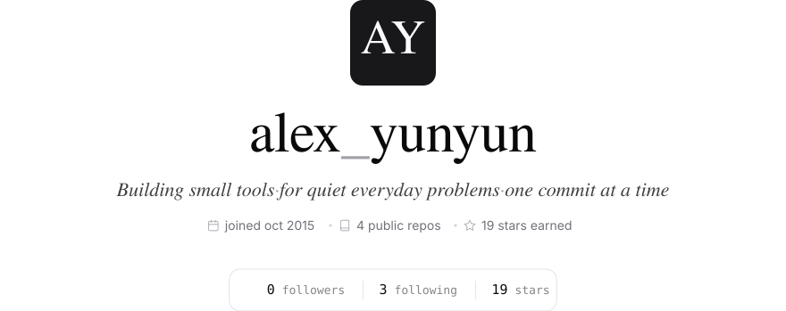
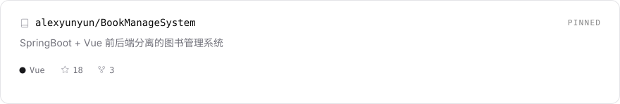
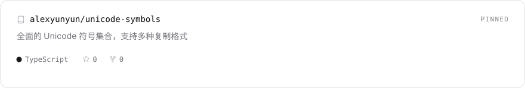
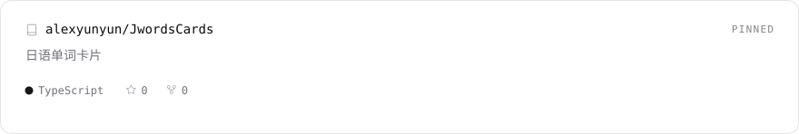
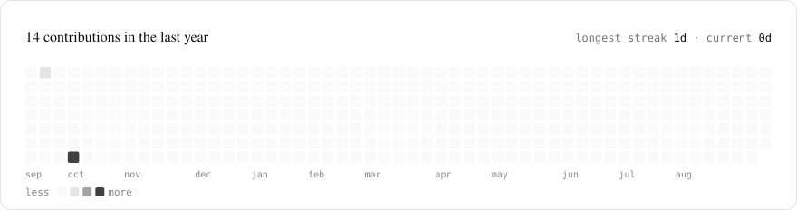
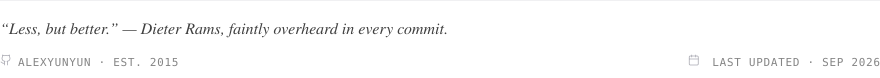

<!--
  极简黑白灰 GitHub 主页 · alexyunyun

  · 所有视觉资产由 scripts/build.py 依据 scripts/data.json 生成，请勿手改 assets/ 下的文件
  · 本地刷新数据并重建：python3 scripts/build.py --fetch
  · 仓库内置每周自动刷新的 Action（.github/workflows/refresh.yml）
  · 图片引用走相对路径，推送到与用户名同名的仓库后即生效
-->

<picture>
  <source media="(prefers-color-scheme: dark)" srcset="assets/chrome-dark.svg">
  
</picture>

<picture>
  <source media="(prefers-color-scheme: dark)" srcset="assets/hero-dark.svg">
  
</picture>

<picture>
  <source media="(prefers-color-scheme: dark)" srcset="assets/section-featured-dark.svg">
  
</picture>

<a href="https://github.com/alexyunyun/BookManageSystem">
  <picture>
    <source media="(prefers-color-scheme: dark)" srcset="assets/repo-bookmanagesystem-dark.svg">
    
  </picture>
</a>

<a href="https://github.com/alexyunyun/unicode-symbols">
  <picture>
    <source media="(prefers-color-scheme: dark)" srcset="assets/repo-unicode-symbols-dark.svg">
    
  </picture>
</a>

<a href="https://github.com/alexyunyun/JwordsCards">
  <picture>
    <source media="(prefers-color-scheme: dark)" srcset="assets/repo-jwordscards-dark.svg">
    
  </picture>
</a>

<picture>
  <source media="(prefers-color-scheme: dark)" srcset="assets/section-tech-stack-dark.svg">
  
</picture>

<picture>
  <source media="(prefers-color-scheme: dark)" srcset="assets/tech-stack-dark.svg">
  
</picture>

<picture>
  <source media="(prefers-color-scheme: dark)" srcset="assets/section-contributions-dark.svg">
  
</picture>

<picture>
  <source media="(prefers-color-scheme: dark)" srcset="assets/contributions-dark.svg">
  
</picture>

<picture>
  <source media="(prefers-color-scheme: dark)" srcset="assets/footer-dark.svg">
  
</picture>
